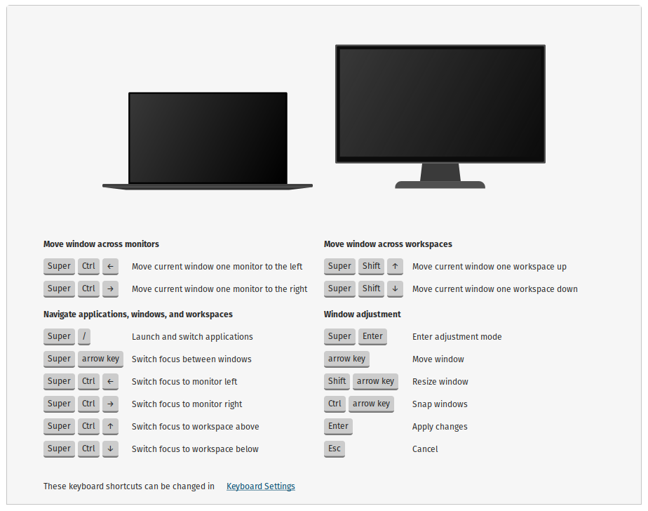

# Pop Shell Keyboard Shortcuts

Application for displaying and demoing Pop Shell shortcuts.



## Dependencies

The following dependencies are required to build `shell-extensions`.

* [cargo](https://packages.debian.org/stable/rust/cargo)
* [rustc](https://packages.debian.org/stable/rust/rustc)
* [libgtk-3-dev](https://packages.debian.org/stable/libdevel/libgtk-3-dev)

On a debian-derived distribution, the required dependencies are easily installed with `apt`.

```sh
apt install cargo libgtk-3-dev rustc
```

## Build

First, get the project's source code.

```sh
git clone https://github.com/pop-os/shell-shortcuts.git
```

The following `make` commands are run from the top-level of the source directory, so move to that directory.

```sh
cd shell-shortcuts
```

The project's sources are built with `make`.

```sh
make
```

Assuming nothing goes wrong, this will generate the `pop-shell-shortcuts` executable in the `target/release` directory.

By default, the application is built for release.
To build the binary with debug symbols, provide `DEBUG=1` with the `make` command.

```sh
make DEBUG=1
```

This will generate the `pop-shell-shortcuts` executable in the `target/debug` directory.

## Install

Install with `make`.

```sh
sudo make install
```

Alternatively, the debug version can be installed.

```sh
sudo make install DEBUG=1
```

An `uninstall` target is also provided to remove the installed application.

```sh
sudo make uninstall
```

## Run

Execute the `pop-shell-shortcuts` binary.
Assuming the binary has been installed in your path, run it as usual.

```sh
pop-shell-shortcuts
```
